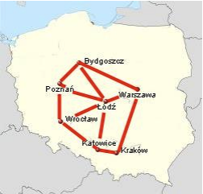
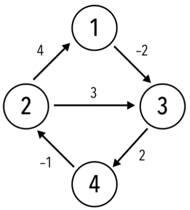

# floyd-warshall-python

# Example 1

## Input
| City:     | Poznań | Wrocław | Bydgoszcz  | Łódź | Warszawa | Kraków | Katowice |
| --------- | ------ | ------- | ---------- | ---- | ---------| ------ | -------- |
| Poznań    | 0      | 180     | 140        | 220  | ∞        | ∞      | ∞        |
| Wrocław   | 180    | 0       | ∞          | 220  | ∞        | ∞      | 200      |
| Bydgoszcz | 140    | ∞       | 0          | 220  | 300      | ∞      | ∞        |
| Łódź      | 220    | 220     | 220        | 0    | 140      | ∞      | 200      |
| Warszawa  | ∞      | ∞       | 300        | 140  | 0        | 290    | ∞        |
| Kraków    | ∞      | ∞       | ∞          | ∞    | 290      | 0      | 80       |
| Katowice  | ∞      | 200     | ∞          | 200  | ∞        | 80     | 0        |

## Visualization

Source: https://math.uni.lodz.pl/~lindner

## Output
| City:     | Poznań | Wrocław | Bydgoszcz  | Łódź | Warszawa | Kraków | Katowice |
| --------- | ------ | ------- | ---------- | ---- | ---------| ------ | -------- |
| Poznań    | 0      | 180     | 140        | 220  | 360      | 460    | 380      |
| Wrocław   | 180    | 0       | 320        | 220  | 360      | 280    | 200      |
| Bydgoszcz | 140    | 320     | 0          | 220  | 300      | 500    | 420      |
| Łódź      | 220    | 220     | 220        | 0    | 140      | 280    | 200      |
| Warszawa  | 360    | 360     | 300        | 140  | 0        | 290    | 340      |
| Kraków    | 460    | 280     | 500        | 280  | 290      | 0      | 80       |
| Katowice  | 380    | 200     | 420        | 200  | 340      | 80     | 0        |

# Example 2

## Input, Visualization

## Output

| #   | v1  | v2  | v3  | v4  |
|-----|-----|-----|-----|-----|
| v1  | 0   | -1  | -2  | 0   |   
| v2  | 4   | 0   | 2   | 4   |  
| v3  | 5   | 1   | 0   | 2   | 
| v4  | 3   | -1  | 1   | 0   |